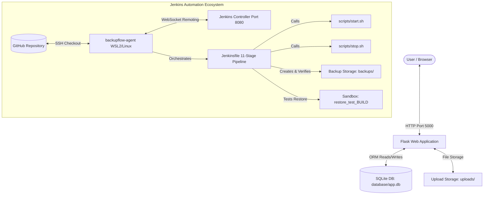
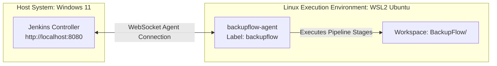
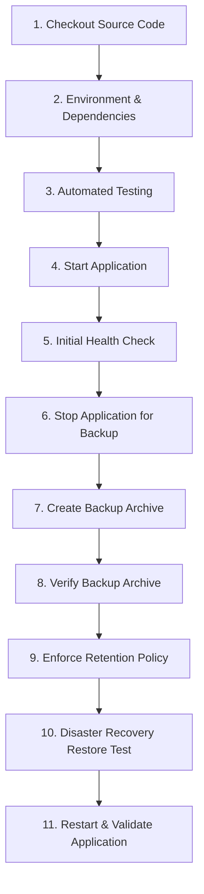

# 💾 BackupFlow — Automated Backup & Disaster Recovery Pipeline with Jenkins

[](#-project-status)
[](#-the-11-stage-jenkins-pipeline-workflow)
[](#-technology-stack--scope-boundaries)
[](#-automated-testing-suite-pytest)

A practical **DevOps & Infrastructure Automation learning project** demonstrating how **Jenkins CI/CD, Bash scripting, and Linux automation** manage web application lifecycles, run automated test suites, execute timestamped backups, verify archive integrity, enforce retention policies, and perform **Disaster Recovery (DR) restore testing** on Ubuntu Linux (WSL2).

---

## 📌 Project Overview & Objective

In many enterprise environments, Jenkins is used not only to compile code and run unit tests, but also to orchestrate **critical operational workflows**: application process management, database backups, storage retention, and disaster recovery validation.

**BackupFlow** was built as a practical learning project to explore and implement these DevOps operational workflows hands-on.

### The Core Problem This Solves:
Creating a backup archive file (e.g., `.tar.gz`) is only the first step in data protection. If a backup file is corrupt, incomplete, or impossible to restore, the backup strategy fails when an actual system outage occurs.

This project implements an **end-to-end automated pipeline** in Jenkins that:
1. Validates code quality using unit tests (`pytest`).
2. Stops the live web application cleanly to prevent database write locks or data corruption during backups.
3. Packages both structured data (`database/app.db`) and unstructured data (`uploads/`).
4. Verifies the generated backup archive structure and readability (`tar -tzf`).
5. Enforces a storage retention policy (retaining the latest 5 backups).
6. Executes automated **Disaster Recovery Restore Testing** in an isolated sandbox directory to validate recoverability.
7. Restarts the web application and verifies live system health via the `/health` endpoint.

---

## 🏗️ Architecture & System Data Flow



### Data Flow Breakdown
1. **Application Runtime State**:
   - **Structured Data**: SQLite database (`database/app.db`) storing asset records.
   - **Unstructured Data**: User-uploaded sample documents in `uploads/`.
2. **Separation of Concerns**:
   - Application source code (`app.py`, `templates/`, `static/`, `config.py`) is version-controlled in Git.
   - Dynamic runtime data (`database/app.db`, `uploads/`, `backups/`) is excluded from Git via `.gitignore` and managed by Jenkins automation.
3. **Jenkins Agent Execution**:
   - The Jenkins Controller coordinates build schedules and UI rendering.
   - Execution occurs on a dedicated agent (`backupflow-agent`) inside a Linux/WSL2 workspace.

---

## 🖥️ Jenkins Controller & Agent Architecture



### Clarification of Connections:
- **Jenkins Controller ↔ Jenkins Agent**: Connected via **WebSocket** (`backupflow-agent` connects back to the Controller).
- **Jenkins Agent ↔ GitHub**: Authenticated via **SSH Key Pair** (`git@github.com:...`) for secure source code checkout.

### Why Use a Dedicated Jenkins Agent?
- **Controller Offloading**: Offloads test execution, file compression, and shell script execution from the Controller node.
- **Environment Isolation**: Provides a native Linux shell environment with Python 3, `tar`, and `curl` pre-installed.
- **Production Alignment**: Mirrors real enterprise setups where builds run on dedicated worker nodes.

---

## 🔄 The 11-Stage Jenkins Pipeline Workflow



### Detailed Pipeline Stage Breakdown

| Stage # | Stage Name | Purpose & Execution Details | Why This Stage Exists |
| :---: | :--- | :--- | :--- |
| **1** | **Checkout Source Code** | Clones repo via SSH (`git@github.com:sujoymodak231/BackupFlow.git`) and logs commit details. | Ensures pipeline executes against the exact commit in GitHub. |
| **2** | **Environment & Dependencies** | Creates Python virtual environment (`python3 -m venv venv`) and installs `requirements.txt`. | Guarantees an isolated, repeatable dependency environment across builds. |
| **3** | **Automated Testing** | Runs `pytest -v` executing 11 unit & integration test cases. | Prevents broken code from reaching runtime or being backed up. |
| **4** | **Start Application** | Makes scripts executable (`chmod +x`) and runs `scripts/start.sh` to launch Flask in background with PID tracking (`app.pid`). | Boots application stack for initial validation. |
| **5** | **Initial Health Check** | Probes `http://127.0.0.1:5000/health` with `curl --retry 5 --retry-connrefused`. | Verifies app is responsive and DB connection is alive before backup. |
| **6** | **Stop Application for Backup** | Runs `scripts/stop.sh` to gracefully terminate Flask process. | Prevents database write locks or corrupted file states during archive compression. |
| **7** | **Create Backup Archive** | Verifies `app.db` and `uploads/` exist, then compresses them to `backups/backup_YYYYMMDD_HHMMSS.tar.gz`. | Creates a point-in-time snapshot of structured & unstructured data. |
| **8** | **Verify Backup Archive** | Validates backup existence and tests archive header readable structure via `tar -tzf`. | Ensures the file is a valid tarball and not a corrupt 0-byte file. |
| **9** | **Enforce Retention Policy** | Lists backups chronologically (`ls -1t`), keeps latest 5 archives, deletes older backups (`xargs -r rm -f`), and verifies remaining count $\le 5$. | Prevents storage disk exhaustion over time. |
| **10** | **Disaster Recovery Restore Test** | Extracts latest archive to `restore_test_${BUILD_NUMBER}`, verifies `app.db` and `uploads/`, runs optional `sqlite3 PRAGMA quick_check;`, and cleans up via `trap`. | **Validates recoverability**: confirms data can be extracted and restored files exist in sandbox environment. |
| **11** | **Restart & Validate Application** | Runs `scripts/stop.sh` then `scripts/start.sh`, pauses 5 seconds, and performs final `curl` health check against `/health`. | Resumes web service operation and confirms post-restore live system health. |

---

## 📜 Process Management Scripts: Why `start.sh` & `stop.sh` Were Decoupled

Rather than embedding inline process management commands inside `Jenkinsfile`, process lifecycle control was refactored into modular Bash scripts:
- [`scripts/start.sh`](scripts/start.sh)
- [`scripts/stop.sh`](scripts/stop.sh)

### Why Decouple Scripts from Jenkinsfile? (Separation of Concerns)
1. **Separation of Concerns**: The `Jenkinsfile` orchestrates high-level pipeline workflow stages, while shell scripts handle application process details.
2. **Local Debuggability**: Developers can run `./scripts/start.sh` or `./scripts/stop.sh` locally on Linux/WSL without needing Jenkins.
3. **Reusability**: Shell scripts can be reused across different CI/CD systems or cron jobs without modifying code.

### Background Process Management & `JENKINS_NODE_COOKIE`
- `scripts/start.sh` launches Flask using `nohup python3 app.py > app.log 2>&1 &` and saves the process ID to `app.pid`.
- In `Jenkinsfile`, setting `environment { JENKINS_NODE_COOKIE = 'dontKillMe' }` prevents Jenkins' ProcessTreeKiller from terminating the background Flask daemon when the shell step completes.

> 💡 **DevOps Context Note**: Using `JENKINS_NODE_COOKIE` is a standard pattern when running background processes in basic Jenkins pipelines. In production enterprise deployments, process management is typically handled by native OS init systems (`systemd`) or container orchestrators (Docker / Kubernetes).

---

## 🔍 Backup vs. Archive Verification vs. Restoration vs. DR Restore Testing

Understanding the distinction between these four concepts is central to modern DevOps & Site Reliability Engineering (SRE):

```text
  [ Create Backup ]  ──> Packaging database & uploads into .tar.gz archive
         │
  [ Verify Archive ] ──> Checking tar structure & header integrity (tar -tzf)
         │
  [ Restore Backup ] ──> Extracting files back to target filesystem
         │
[ Disaster Recovery ] ──> End-to-end sandbox extraction, file checks, optional DB PRAGMA check,
  Restore Testing        workspace cleanup, and app restart to validate recoverability.
```

| Concept | Action Taken in Pipeline | Why It Matters |
| :--- | :--- | :--- |
| **Creating a Backup** | Archives `database/app.db` and `uploads/` into a timestamped `.tar.gz` file. | Preserves data snapshots. |
| **Verifying an Archive** | Runs `tar -tzf backup.tar.gz` to inspect tar headers. | Confirms the file is a readable tarball (does NOT verify logical SQL data validity). |
| **Restoring a Backup** | Uncompresses archive contents back to a target path. | Restores files to disk during recovery. |
| **Disaster Recovery Restore Testing** | Extracts archive into a sandbox directory (`restore_test_${BUILD_NUMBER}`), verifies `app.db` & `uploads/`, runs optional `sqlite3 PRAGMA quick_check;`, cleans up workspace, and restarts app. | **Validates recoverability**: provides concrete evidence that backup archives can be extracted and restored into a working state. |

---

## ⏰ Scheduled Automated Backups (`H 2 * * *`)

The Jenkins job is configured with automated cron-style scheduling:

- **Build Trigger**: Build Periodically (`H 2 * * *`)
- **Schedule Explanation**: The `H` (hash) symbol instructs Jenkins to run the job once daily during the **2:00 AM hour**, distributing the exact minute based on the job name to prevent resource spikes.

```text
Scheduled Time (2 AM Hour) ──> Jenkins Triggers Job ──> 11-Stage Pipeline Runs Automatically
```

> ⚠️ **Infrastructure Availability Note**:
> Because the Jenkins Controller and `backupflow-agent` run locally within WSL2 / Linux on a development workstation, the host machine, WSL2 environment, and Jenkins agent service must be powered on and connected for scheduled builds to execute.

---

## 🧪 Automated Testing Suite (`pytest`)

The project includes an automated test suite executed during Stage 3 of the pipeline.

```bash
pytest -v
```

### Test Suite Output (11 Passed):
```text
============================= test session starts =============================
platform win32 -- Python 3.11.1, pytest-7.4.3, pluggy-1.6.0
rootdir: C:\Users\skmkn\Desktop\BackupFlow
plugins: anyio-3.6.2
collected 11 items

tests/test_app.py::test_app_starts PASSED                                [  9%]
tests/test_app.py::test_health_endpoint PASSED                           [ 18%]
tests/test_app.py::test_dashboard_loads PASSED                           [ 27%]
tests/test_app.py::test_database_connection PASSED                       [ 36%]
tests/test_app.py::test_create_and_retrieve_record PASSED                [ 45%]
tests/test_app.py::test_edit_record PASSED                               [ 54%]
tests/test_app.py::test_delete_record PASSED                             [ 63%]
tests/test_app.py::test_file_upload PASSED                               [ 72%]
tests/test_app.py::test_file_download_and_delete PASSED                  [ 81%]
tests/test_app.py::test_backup_stats PASSED                              [ 90%]
tests/test_app.py::test_format_bytes_utility PASSED                      [100%]

============================= 11 passed in 0.61s ==============================
```

---

## 🔌 Health Check API Specification (`GET /health`)

The application exposes a dedicated health check JSON API probe used by Jenkins in Stage 5 and Stage 11.

### Request:
```bash
curl -X GET http://127.0.0.1:5000/health
```

### Response (HTTP 200 OK):
```json
{
  "backup_count": 1,
  "database": "connected",
  "record_count": 7,
  "status": "healthy",
  "timestamp": "2026-09-03T07:44:46.059494Z",
  "upload_count": 4
}
```

---

## 📂 Project Directory Structure

```text
BackupFlow/
├── app.py                  # Main Flask application entry point & routes
├── config.py               # Path & environment settings
├── requirements.txt        # Python package dependencies
├── Jenkinsfile             # Declarative 11-stage Jenkins pipeline
├── README.md               # Project documentation
├── .gitignore              # Excludes venv, app.db, uploads, backups, .env
├── .env.example            # Environment variables template
│
├── database/               # Database directory
│   ├── .gitkeep
│   └── app.db              # SQLite Database (Runtime generated, excluded from Git)
│
├── uploads/                # User upload directory
│   ├── .gitkeep
│   ├── database_schema_v1.4.sql
│   ├── system_config_v2.json
│   ├── company_assets_audit.csv
│   └── infrastructure_notes.txt
│
├── backups/                # Target backup storage
│   ├── .gitkeep
│   └── backup_20260831_080000.tar.gz  # Runtime archive (Excluded from Git)
│
├── templates/              # HTML5 Jinja2 Templates
│   ├── base.html
│   ├── dashboard.html
│   ├── records.html
│   ├── edit_record.html
│   ├── uploads.html
│   └── backups.html
│
├── static/                 # CSS & Client JavaScript
│   ├── css/style.css
│   └── js/main.js
│
├── tests/                  # Pytest Automated Test Suite
│   ├── conftest.py
│   └── test_app.py
│
└── scripts/                # Modular Bash Automation Scripts
    ├── start.sh            # Starts app in background with PID tracking
    └── stop.sh             # Gracefully terminates app process
```

---

## 🛠️ Technology Stack & Scope Boundaries

### Core Technologies Used:
- **Automation & CI/CD**: Jenkins, Declarative Jenkinsfile (`pipeline { ... }`)
- **Agent Environment**: Ubuntu Linux / WSL2, Dedicated Agent Node (`backupflow-agent`)
- **Scripting & Tooling**: Bash (`tar`, `curl`, `pgrep`, `xargs`), Git, SSH Keys
- **Backend Application**: Python 3, Flask 3.x, Flask-SQLAlchemy, SQLite3
- **Testing**: `pytest`

### Technologies Intentionally Excluded:
* ❌ **No Docker / No Kubernetes**: Scope is bare-metal / VM Linux process automation.
* ❌ **No Terraform / Ansible**: Scope is Jenkins pipeline capabilities and Linux shell scripting.
* ❌ **No AWS / Cloud Storage**: Scope is local Linux storage retention and recovery logic.

---

## 💻 Quick Reference Commands

### Application Management:
```bash
# Run locally with virtual environment
python3 -m venv venv
source venv/bin/activate
pip install -r requirements.txt
python3 app.py

# Start / Stop via Bash Automation Scripts
./scripts/start.sh
./scripts/stop.sh
```

### Testing & Verification:
```bash
# Run Pytest suite
pytest -v

# Health Check Probe
curl http://127.0.0.1:5000/health

# List Backups & Inspect Tarball Contents
ls -lh backups/
tar -tzf backups/backup_*.tar.gz
```

### Git & Source Control:
```bash
git status
git add .
git commit -m "Update Jenkinsfile pipeline configuration"
git push origin main
```

---

## 🤝 AI Assistance & Development Disclosure

This project was developed as a hands-on **DevOps learning project**:

- **Application Code & Boilerplate**: AI assistance was used during learning to build the initial Flask application structure, HTML templates, CSS styles, and database models.
- **DevOps & Infrastructure Automation**: Implemented, tested, and debugged by me:
  - Setting up the Linux / WSL2 environment.
  - Configuring the Jenkins Controller and WebSocket connection for `backupflow-agent`.
  - Configuring GitHub SSH authentication key pairs and Jenkins credentials.
  - Authoring and refining the 11-stage `Jenkinsfile`.
  - Developing Bash lifecycle scripts ([`scripts/start.sh`](scripts/start.sh) and [`scripts/stop.sh`](scripts/stop.sh)).
  - Implementing data checks, retention rules (`xargs -r rm -f`), and sandbox restore testing.
  - Configuring cron build triggers (`H 2 * * *`).

---

## 🧠 Key DevOps Concepts Learned & Practiced

Through this project, I practiced:
- **Pipeline as Code**: Authoring declarative `Jenkinsfile` pipelines with options, environment variables, stages, and post handlers.
- **Jenkins Master-Agent Architecture**: Setting up dedicated execution nodes connected via WebSocket.
- **Linux Process Management**: Controlling background daemons using `nohup`, PID files, and managing Jenkins `JENKINS_NODE_COOKIE`.
- **Data Protection Automation**: Separating code from dynamic state, creating compressed snapshots, and enforcing retention rules.
- **Recoverability Validation**: Moving beyond backup creation to validate file existence and run database integrity checks in temporary sandbox directories.

---

## 📊 Project Status

**Status: Fully Operational & Verified** ✅

- [x] Flask Web Application & CRUD Interface
- [x] Dedicated `/health` JSON Endpoint
- [x] 11 Automated Pytest Unit Tests Passing
- [x] 11-Stage Declarative Jenkins Pipeline
- [x] Dedicated `backupflow-agent` Execution Node
- [x] Background Process Control (`start.sh` / `stop.sh`)
- [x] Automated Timestamped Backup Creation (`.tar.gz`)
- [x] Archive Integrity Verification (`tar -tzf`)
- [x] Retention Policy Enforcement (Max 5 backups)
- [x] Sandbox Disaster Recovery Restore Testing & Workspace Cleanup
- [x] Scheduled Daily Backups (`H 2 * * *`)

---

## 📸 Screenshots

Screenshots will be added here to document:
- Jenkins pipeline 11-stage execution view
- Jenkins agent configuration (`backupflow-agent`)
- BackupFlow application dashboard
- `/health` endpoint JSON response

---

## 🔮 Future Improvements Roadmap

Planned areas for future learning:
- **Systemd Service Integration**: Transitioning process management from Bash scripts to native Linux `systemd` unit services.
- **Remote Cloud Backup Sync**: Adding a stage to upload backup archives to AWS S3 or MinIO.
- **Backup Encryption**: Encrypting `.tar.gz` archives using GPG or OpenSSL.
- **Pipeline Notifications**: Adding Slack or email alerts in the `post` block on build success/failure.
- **Containerization & Orchestration**: Containerizing Flask with Docker and deploying to Kubernetes.
